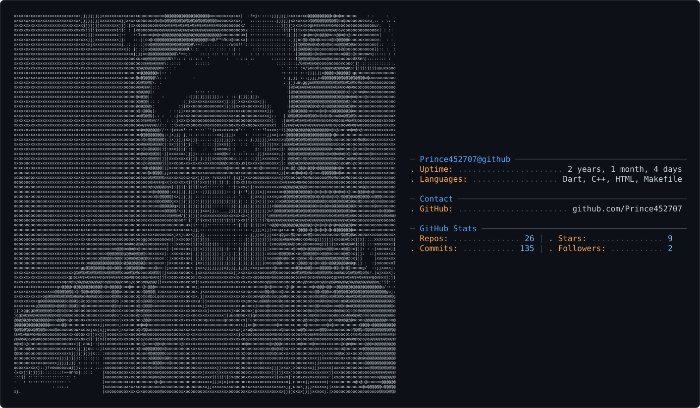

  <picture>
    <source media="(prefers-color-scheme: dark)" srcset="dark_mode.svg" />
    <source media="(prefers-color-scheme: light)" srcset="light_mode.svg" />
    
  </picture>

---

  <strong>Builder @ Vecontra | Flutter • Node.js</strong>

