<p align="center">
  
</p>

<p align="center">
  
</p>

<br/>

<!-- ═══ THE DUEL ═══ -->
<p align="center">
  
</p>

<br/>

<!-- ═══ WANTED POSTER ═══ -->
<p align="center">
  
</p>

<br/>

<!-- ═══ THE SCRIPT / THE METHOD ═══ -->
<h2 align="center">
  🎬 &nbsp; <i>Scene I: The Method</i>
</h2>

<p align="center">
  <sub>━━━━━━━━━━━━━━━━━━━━━━━━━━━━━━━━━━━━━━━━</sub>
</p>

```
[ SCENE START: 00:00:01 ]

LOCATION : Production Ground
ATMOSPHERE: Dead silence. High stakes. Complex systems.

    While others debate in meetings, he dissects the codebase.
    No noise. No panic. Cold-blooded focus.

    He doesn't write code to fill repositories.
    He writes code to solve what others call impossible.

    A lethal mix of Kotlin, Java, React, and RAG pipelines—
    dispatched with surgical calm and zero hesitation.

    "Move in silence. Let the shipped product make the noise."

[ SCENE END ]
```

<br/>

<!-- ═══ THE ARSENAL ═══ -->
<h2 align="center">
  ⚔️ &nbsp; <i>The Arsenal</i>
</h2>

<p align="center">
  <sub>━━━━━━━━━━━━━━━━━━━━━━━━━━━━━━━━━━━━━━━━</sub>
</p>

<p align="center">
  
</p>

<br/>

<!-- ═══ THE RECORD ═══ -->
<h2 align="center">
  📜 &nbsp; <i>The Record</i>
</h2>

<p align="center">
  <sub>━━━━━━━━━━━━━━━━━━━━━━━━━━━━━━━━━━━━━━━━</sub>
</p>

<p align="center">
  
</p>

<br/>

<!-- ═══ THE TRAIL ═══ -->
<h2 align="center">
  🐎 &nbsp; <i>The Trail</i>
</h2>

<p align="center">
  <sub>━━━━━━━━━━━━━━━━━━━━━━━━━━━━━━━━━━━━━━━━</sub>
</p>

<p align="center">
  <a href="https://github.com/Prince452707">
    
  </a>
</p>

<br/>

<!-- ═══ CLOSING CREDITS ═══ -->

<p align="center">
  <sub>━━━━━━━━━━━━━━━━━━━━━━━━━━━━━━━━━━━━━━━━</sub>
</p>

<p align="center">
  
</p>

<p align="center">
  <i>"No hesitation. No noise. Just clean shots and shipped systems."</i>
</p>

<p align="center">
  <sub>★ &nbsp; Hand-crafted cinematic direction. &nbsp; ★</sub>
</p>

<p align="center">
  <sub>━━ F I N ━━</sub>
</p>