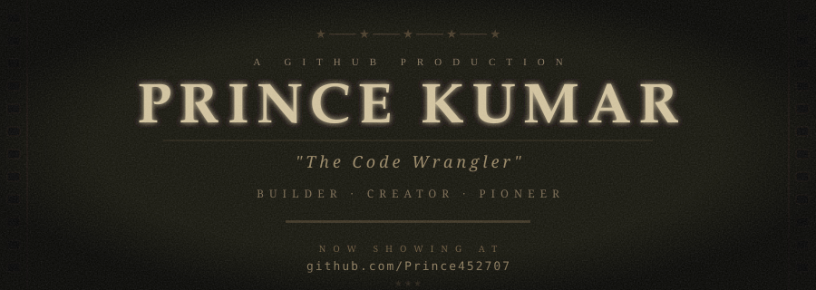

<!-- Header banner using local SVG -->

  

<!-- Optional: typing SVG (external service) -->

  

---

# 🚀 Prince Kumar &nbsp;|&nbsp; Crypto Dev & Founder

🔭 Currently building **Vecontra – Data‑Driven Crypto Intelligence for Indian users**  
🌱 Exploring **AI‑powered research, on‑chain analytics, RAG (Retrieval‑Augmented Generation), AWS & interactive developer experiences**  
💼 Experience with **Flutter, Kotlin, Node.js, REST APIs, crypto data providers, AWS & dashboard‑style apps**  
⚡ Specialized in **Dart, Kotlin, Node.js, API integration, GitHub Actions & research workflows**  
🤖 Curious about **LLMs, Web3 tooling, analytics, and dev‑first crypto products**  
🎯 Goal: **Build scalable crypto research products and a strong developer brand**

---

## 🧑‍💻 About Me

- 🇮🇳 Based in Uttar Pradesh, India  
- 🧠 Focused on **crypto research platforms** and **developer‑friendly tools**  
- 🎥 Create **short‑form educational content** (Reels & Shorts) around crypto & tech  
- 🛠 Love making **API‑driven, data‑heavy applications** that feel simple for users  
- ☁️ Learning and using **AWS** for hosting APIs, dashboards and RAG‑style AI services  
- 🧩 Currently experimenting with **RAG (Retrieval‑Augmented Generation)** to ground AI answers in real crypto data and research documents  

---

## ⚒️ Languages · Frameworks · Tools

**Languages**

- Dart, JavaScript/TypeScript  
- Kotlin for Android / backend experiments  
- A bit of Python for scripts and data tasks  

**Frameworks & Platforms**

- Flutter & Flutter Web  
- Node.js (Express / REST APIs)  
- Basic Kotlin backend experiments  
- GitHub Actions for automation  

**Tools & Services**

- AWS (cloud hosting, APIs, basic infrastructure)  
- Crypto data APIs (CoinGecko, CryptoCompare, etc.)  
- VS Code, Android Studio, Git, GitHub  
- Basic CI/CD and deployment workflows  
- Vector databases / embeddings for **RAG‑style AI apps** (connecting external knowledge bases to LLMs)  

---

## 🛰 Vecontra – My Main Project

> **Vecontra** – Real‑Time Crypto Analytics, DeFi Insights & AI‑Powered Research for Indian users.

- 🌐 Live app: https://www.vecontra.com/  
- 📊 Market overview: total market cap, 24h volume, active assets  
- 🔍 Research focus: narratives, fundamentals, on‑chain & DeFi data  
- 🎯 Audience: Indian retail and serious crypto users who want verified data  

---

## 🐍 My Contributions (Profile Activity)

> This section highlights my public GitHub activity.  
> (Later I’ll add dynamic contribution graphs and widgets.)

- 🚧 Building and iterating on **Vecontra**  
- 🧪 Experimenting with **Flutter + Kotlin + Node.js + AWS + API‑driven dashboards**  
- 📦 Creating reusable patterns for **crypto research apps** and **RAG‑powered tools**  

---

## ⚡ GitHub Stats (Planned)

> I’ll add visual stats cards here (commits, languages, top repos) using public GitHub‑stats services.

_For now, this is a placeholder section to match the structure:_

- 🔢 Commit activity & contribution graphs  
- 🧮 Language breakdown (Dart, Kotlin, JS/TS, etc.)  
- ⭐ Highlighted repos once they’re ready  

---

## 🎮 Interactive Games on My Profile

You can play games using GitHub Issues in this repo and interact with my README.

### Game 1 – Algorithm Arena

Pick a lane and solve with code in your own repo or a Gist.

**Lanes:**

- 🧮 `easy` – arrays, strings, basic loops  
- 🧠 `medium` – trees, graphs, DP  
- 🚀 `hard` – performance, design, multi‑API problems  

**How to play:**

1. Open an Issue in `Prince452707/Prince452707`.  
2. Use this title format:

   - `Game: Algorithm Arena [easy]`  
   - `Game: Algorithm Arena [medium]`  
   - `Game: Algorithm Arena [hard]`  

3. In the issue description, include:
   - The problem statement  
   - Your approach  
   - Link to your solution repo / Gist  

---

### Game 2 – Vecontra Feature Pitch

Pretend you’re a product engineer for Vecontra.

**Your task:** Design a small feature that would help Indian crypto users research faster.

**How to play:**

1. Open an Issue titled: `Game: Vecontra Feature Pitch`  
2. In the issue body, answer:

   - Problem: What user pain are you solving?  
   - Solution: Describe the feature in 3–5 bullet points  
   - Tech: What APIs / data would you use?  
   - UI: Briefly describe how it looks in Vecontra  

---

### Game 3 – Crypto Tic‑Tac‑Toe (🐂 vs 🐻)

A simple board game played via Issues; I’ll keep the board and scores updated.  
Scoreboard is shown using `game-score.svg` below.

**Current Board**

|   |   |   |
|---|---|---|
| 1 | 2 | 3 |
| 4 | 5 | 6 |
| 7 | 8 | 9 |

**How to play:**

1. Choose your side:  
   - Bulls (X) → issue title: `Game: TTT Bulls`  
   - Bears (O) → issue title: `Game: TTT Bears`  
2. In the issue body, write:
   - The cell number you want (1–9)  
   - Optional: a short crypto reason for your move  

I’ll update this table with 🐂 or 🐻 and announce winners in a Hall of Fame.

---

## 📬 Connect With Me

- 🌐 App: [Vecontra](https://www.vecontra.com/)  
- 🐙 GitHub: [@Prince452707](https://github.com/Prince452707)  
- 📧 Email: princevecontra@gmail.com  
- 📹 Content: Reels / Shorts links coming soon  

---

> This profile is inspired by structured, developer‑focused READMEs and will evolve into a live crypto + dev dashboard over time.
